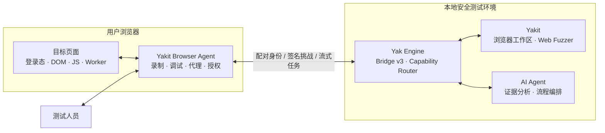

<p align="center">
  
</p>

<h1 align="center">Yakit Browser Agent</h1>

<p align="center">
  面向真实浏览器上下文的安全测试与 AI Agent 协作扩展
</p>

<p align="center">
  连接浏览器、Yak 引擎与 Yakit，让登录态、页面函数、前端加解密、网络请求和人工操作成为可授权、可复用、可审计的测试能力。
</p>

> [!IMPORTANT]
> Yakit Browser Agent 面向已获授权的安全测试、企业自测和教学环境。扩展具备读取登录态、捕获网络请求、调用页面函数和调试页面执行现场等高权限能力；请只对你拥有或明确获准测试的目标使用。

## 项目定位

Yakit Browser Agent 是 Yak / Yakit 生态中的浏览器执行端。它运行在用户真实使用的浏览器里，在用户明确授权后，将特定标签页的页面上下文、安全测试能力和人工交互能力提供给 Yak 引擎、Yakit 工作区以及 AI Agent。

它重点解决传统安全测试工具难以自然处理的几类问题：

- 目标功能依赖已经登录的浏览器环境，无法仅靠离线 HTTP 请求复现；
- 请求参数由混淆后的前端代码、闭包状态、动态密钥、`CryptoKey`、Worker 或 WebAssembly 现场生成；
- 测试者希望编辑明文，但目标服务器只接受页面产生的密文、签名或动态请求封装；
- 流程包含扫码、MFA、CAPTCHA、设备确认等必须由用户参与的步骤；
- 双身份授权测试需要可靠隔离登录态、复用真实请求并保留可复核证据；
- AI Agent 需要浏览器提供真实、结构化、受控的上下文，而不是依赖截图猜测或导出完整浏览器配置。

本项目并不是只针对某个靶场编写的加解密脚本，也不是一个简单的 JS-RPC 转发器。它以通用的调用证据、业务 Trace、请求边界、页面 Callable 和类型化 Pipeline 为基础：能由确定性证据完成的步骤交给代码验证，证据不足或语义复杂的部分再交给用户与 AI 辅助分析。

## 设计原则

| 原则 | 说明 |
| --- | --- |
| 真实现场优先 | 复用页面正在运行的函数、receiver、闭包和浏览器状态，不要求先把密钥或完整算法导出到外部。 |
| 证据驱动 | 通过值指纹、调用顺序、业务 Trace、请求字段关联和响应归属建立结论，不因“发现某个加密库”就直接猜测转换逻辑。 |
| 用户明确授权 | 所有远程能力绑定具体标签页、Frame、文档、来源、任务、权限范围和有效期，授权可见、可暂停、可撤销。 |
| 确定性验证与 AI 协作 | AI 用于解释、归纳和提出方案；协议校验、Profile 编译、真实回放和结果比较由确定性代码完成。 |
| 通用能力优先 | 对库、算法和业务形态建立适配层，不以固定字段名、固定接口或单一靶场流程作为产品逻辑。 |
| 本地与性能优先 | 大型代理规则使用 IndexedDB 分块存储和编译缓存；敏感页面数据默认短时保留，诊断与审计只记录必要元数据。 |

## 系统组成



扩展不允许远程调用方直接访问浏览器 API。所有命令统一经过 Capability Router、参数 Schema、授权 Scope 和文档生命周期检查，再由对应功能模块执行。

## 核心能力

### 1. 前端加解密录制与明文网关

这是 Yakit Browser Agent 的核心工作流。测试者只需要在真实页面完成一次尽可能短的业务操作，扩展会从页面输入、密码调用、编码转换、通信边界和最终请求中还原数据流。

主要能力包括：

- 录制 Fetch、XHR、表单导航、Beacon、WebSocket、Worker、SharedWorker 和 MessagePort 等业务边界；
- 记录加解密调用的输入、输出指纹、调用栈、receiver、固定参数模板与请求先后关系；
- 将同一业务动作组织为按时间排序的 Trace，区分页面原始函数与扩展注入的观测 Hook；
- 自动推断明文来源、密码调用和线上请求字段之间的关联；
- 在证据充分时直接生成请求或响应方向的明文网关；
- 在普通录制无法保留状态时，使用 Chromium Deep Capture 捕获闭包、模块脚本、`CryptoKey`、WebAssembly 实例或多调用请求事务；
- 将捕获到的业务调用保存为文档绑定的页面 Callable，无需向外导出页面密钥；
- 使用类型化 Pipeline 组合上下文读取、页面调用、白名单转换、字段装配和输出写入；
- 在本地回放中使用录制的短时样本验证转换关系；
- 与 Yakit Web Fuzzer 联动：编辑逻辑明文，由真实页面生成线上密文或签名，同时并排查看“明文 / 线上”报文。

当前观测与推断适配层覆盖：

- Web Crypto API；
- CryptoJS；
- JSEncrypt；
- jsrsasign；
- node-forge；
- sm-crypto；
- JOSE；
- libsodium；
- TweetNaCl；
- Noble；
- OpenPGP。

适配器用于识别通用调用语义，并不意味着所有混淆代码都可以无条件自动还原。自动化程度取决于录制证据是否能够证明“明文输入 → 页面调用 → 请求字段”或“线上响应字段 → 页面调用 → 明文输出”的完整链路；证据不足时，界面会明确展示缺失环节，并引导进入深度捕获或 AI 辅助分析。

### 2. 登录态上下文与 AI Agent 协作

扩展可以把用户明确共享的浏览器页面转换为适合 Agent 使用的结构化上下文，而不是直接导出完整 HTML 或浏览器 Profile。

- 采集页面文档信息、认证信号、表单、交互元素、开放 Shadow DOM、Storage 与 Cookie 清单；
- 使用文档绑定的节点引用执行检查、点击、聚焦、滚动和输入等操作；
- 追踪上下文差异，帮助 Agent 判断登录、跳转和业务状态变化；
- 在独立权限下调用页面已有函数，或执行表达式与程序级 Eval；
- 捕获已授权文档的真实网络请求，并生成可在 Yakit 中重放的报文；
- 将录制 Trace、Callable、Transform Profile、请求事务和验证结果作为 Agent 工具能力；
- 在 Agent 遇到扫码、MFA、CAPTCHA 或设备确认时创建“人工接管”任务，聚焦目标标签页并等待用户完成后继续。

程序级 Eval、敏感网络字段、深度捕获和页面控制均属于高风险 Scope，不会被只读共享会话隐式包含。

### 3. 双身份水平与垂直授权测试

授权测试工作区用于组织两个真实登录身份，并以可复核的方式验证资源访问或权限动作。

- 在普通窗口、无痕窗口或其他受支持的隔离上下文中选择身份 A / B；
- 校验 Cookie Store、认证材料和页面上下文是否真正隔离；
- 自动读取双方最近的同类业务请求，建立 A/B 正常基线；
- 从 Query、Path、Header、表单或结构化 Body 中提取资源候选；
- 水平授权测试使用固定请求预算构造 A-own、B-own、A-to-B、B-to-A 四项矩阵；
- 垂直授权测试对比低权限控制请求与高权限目标动作，并明确提示潜在副作用；
- 对状态码、响应结构、业务字段和目标身份正常响应进行差异比较；
- 对时间戳、请求 ID 等易变噪声进行归一化，保留可解释的业务差异；
- 将短时证据包交给 Yakit 与 AI Agent 深入分析，同时避免用插件预判结论暗示 AI；
- 由确定性证据给出“观察到什么”，由用户、业务规则和独立 AI 复核决定是否构成真实授权缺陷。

扩展不会因为交叉请求返回 `200` 就直接判定越权，也不会绕过真实身份隔离要求。

### 4. 自动代理与规则系统

代理模块面向日常安全测试和多出口切换，交互方式接近现代化的 SwitchyOmega / ZeroOmega 工作流，但针对大规则集和扩展运行时做了重新设计。

- 创建并管理多个代理出口；
- 为不同域名、URL 模式或规则条件选择指定出口；
- 支持直连、代理和自动切换情景；
- 在 Popup 中快速切换当前出口，或为当前站点建立规则；
- 导入和更新远程规则订阅；
- 将规则编译为 PAC，并在应用前完成规范化和错误检查；
- 使用 IndexedDB 按块保存大型规则源，避免把完整订阅反复塞入同步状态；
- 缓存有限数量的编译产物，并清理过期 Revision；
- 通过分页与搜索读取规则，不要求一次渲染全部内容。

该模块只决定浏览器请求应当走哪个代理出口。Yak MITM 可以作为其中一个代理出口使用，但扩展不会替用户控制或改变 MITM 内部规则。

### 5. Cookie Editor 与 User-Agent 快速切换

Popup 提供针对当前站点的高频操作，Options 提供完整管理界面。

- 查看、添加、编辑和删除当前站点 Cookie；
- 支持 Domain、Path、SameSite、安全标记与分区 Cookie 元数据；
- 支持 Cookie 过滤、导入与导出；
- 提供常用设备 User-Agent 模板；
- 创建、保存和删除自定义 User-Agent；
- 将 User-Agent 分配给指定 Hostname，并立即作用于真实网络请求头。

User-Agent 工具只修改网络请求头，不伪装 `navigator`、Client Hints、屏幕信息、Canvas、TLS 或其他浏览器指纹。界面会明确提示这一边界。

### 6. 安全配对与浏览器共享会话

Yak gRPC 进程内置 Browser Bridge v3，扩展无需额外启动桥接脚本，也不依赖手工复制的长期 Token。

- 首次配对显示六位校验码，由用户同时在扩展与 Yakit 中确认；
- 扩展生成不可导出的 ECDSA P-256 安装身份，Yak 保存独立引擎身份；
- 后续连接通过双向身份、签名挑战、扩展 Origin 和安装 ID 完成认证；
- 支持多个浏览器设备同时在线，并按设备 ID 精确路由任务；
- 共享会话绑定标签页、Frame、文档、Origin、Task、Scope 和过期时间；
- 页面刷新、文档替换或跨来源导航不会静默继承原授权；
- 用户可以随时暂停 Agent、撤销共享会话或在 Yakit 中撤销整个浏览器设备；
- 审计日志只记录方法、目标类型、耗时、结果和错误码等元数据，不保存 Cookie 值、页面正文、Eval 源码、请求载荷或执行结果。

## 产品界面

| 界面 | 主要用途 |
| --- | --- |
| Popup | 查看当前页面与引擎状态；快速切换代理、Cookie 和 User-Agent；进入完整工作区。 |
| Options | 运行概览、授权测试、代理出口、自动切换、规则订阅、网络活动、Cookie Editor、UA 管理、登录态工作区、引擎连接与操作记录。 |
| 页面悬浮面板 | 贴近当前页面的轻量操作入口，可吸附屏幕边缘，并在需要时展开代理、接管和任务状态。 |
| Yakit 浏览器集成 | 管理已配对设备、执行浏览器任务、查看录制与明文网关，并与 Web Fuzzer 联动。 |
| Yak AI Agent | 调用经过授权的浏览器能力，分析证据、编排流程，并在必须人工参与时等待用户接管。 |

## 快速开始

### 环境准备

完整能力需要以下组件：

- Chrome / Chromium / Edge，或受支持的 Firefox；
- Node.js 与 pnpm；
- 包含 Browser Bridge v3 的 Yak 引擎；
- 包含“浏览器集成”工作区的 Yakit。

仅使用代理、Cookie、User-Agent 等本地工具时，不要求连接 Yak 引擎。

### 安装依赖并启动开发模式

```bash
git clone https://github.com/yaklang/yaklang-chrome-extension.git
cd yaklang-chrome-extension
pnpm install
pnpm dev
```

如果浏览器没有自动加载扩展：

1. 打开 `chrome://extensions`；
2. 开启“开发者模式”；
3. 选择“加载已解压的扩展程序”；
4. 加载 `.output/chrome-mv3-dev`。

### WSL 开发

WXT 在 WSL 环境中不会自动打开浏览器。项目提供了单独的启动器：

```bash
pnpm dev:wsl
```

开发 Profile 位于 `.wxt/chrome-wsl-profile`。当前稳定版 Chrome 不接受无人值守的 `--load-extension` 参数时，首次仍需在 `chrome://extensions` 手动加载 `.output/chrome-mv3-dev`；之后该 Profile 会记住扩展。

如需指定 Chromium 或 Chrome for Testing：

```bash
CHROME_PATH=/path/to/chromium pnpm dev:wsl
```

## 连接 Yak 与 Yakit

在 Yak 仓库中启动 gRPC 引擎：

```bash
go run common/yak/cmd/yak.go grpc --host 0.0.0.0
```

标准启动会在 `127.0.0.1:64333` 自动启动 Browser Bridge，无需额外参数。

首次配对：

1. 在 Yakit 打开“系统设置 → 浏览器集成”；
2. 在扩展 Options 打开“引擎连接”；
3. 点击“查找本机 Yakit”；
4. 对比扩展与 Yakit 显示的六位校验码；
5. 确认一致后，在 Yakit 批准待配对浏览器。

配对完成后，设备身份会持久保存，后续通过签名挑战自动认证。若在 Yakit 中撤销设备，当前连接会立即关闭，浏览器必须重新配对。

非默认部署可以使用：

- `--browser-extension-bridge-port`：修改 Bridge 监听端口；
- `--disable-browser-extension-bridge`：显式关闭 Browser Bridge；
- Native Messaging：在浏览器无法直接访问回环 Bridge，或需要受管部署时使用。

Native Host 的构建与注册方式见 [native-host/README.md](./native-host/README.md)。

## 典型工作流

### 从真实页面生成明文网关

1. 打开目标页面，在扩展中选择对应标签页；
2. 进入“网络活动”，在“录制”中开始一次操作；
3. 回到目标页面，完成一次登录、查询、提交或解密操作；
4. 停止录制，查看按时间排序的业务 Trace 与自动推断 Profile；
5. 证据充分时直接生成明文网关；证据不足时按提示进入“深度捕获”，再执行一次最小业务动作；
6. 在“明文网关”查看数据流、页面函数、字段映射和本地回放结果；
7. 保存后创建或复用浏览器共享会话；
8. 在 Yakit Web Fuzzer 选择对应的浏览器明文网关，编辑明文并发送。

页面刷新或跨文档导航后，依赖旧页面闭包的 Callable 可能失效。扩展会保留录制证据，但不会把旧函数静默绑定到新文档。

### 进行双身份授权测试

1. 准备两个已经登录不同账号、且认证上下文真正隔离的页面；
2. 在“授权测试”中分别选择身份 A 与身份 B；
3. 执行身份校验并开始双方请求捕获；
4. 在两个页面分别完成同类业务动作；
5. 让扩展自动选择正常基线，或手动确认请求；
6. 选择资源字段或权限动作，审阅确定性测试计划；
7. 确认请求预算与潜在副作用后执行；
8. 查看四项矩阵、报文、结构化差异和业务归属证据；
9. 将短时证据包交给 Yakit / AI Agent 做独立复核。

同一浏览器普通窗口中的两个标签页通常共享 Cookie，不能仅凭“两个 Tab”证明身份隔离。Chromium 推荐使用普通窗口与无痕窗口，Firefox 可使用受支持的隔离上下文。

### 让 Agent 使用登录后的页面

1. 在“引擎连接”中勾选需要共享的 Tab 与 Frame；
2. 选择只读或控制权限预设，并设置 15 分钟至 4 小时的有效期；
3. 如确有必要，单独开启程序级 Eval；
4. 创建浏览器共享会话；
5. 在 Yakit 或 Yak AI Agent 中选择对应设备执行任务；
6. 随时在扩展中暂停、恢复或撤销会话。

## 构建与验证

### 常用命令

| 命令 | 用途 |
| --- | --- |
| `pnpm dev` | 启动 Chromium 开发模式。 |
| `pnpm dev:wsl` | 使用持久 Profile 启动 WSL 开发环境。 |
| `pnpm dev:firefox` | 启动 Firefox 开发模式。 |
| `pnpm compile` | 运行 TypeScript 类型检查，不生成文件。 |
| `pnpm test` | 运行 Vitest 测试。 |
| `pnpm build:store` | 构建 Chrome Store 包。 |
| `pnpm build:enterprise` | 构建本地或企业受管部署包。 |
| `pnpm build:firefox` | 构建 Firefox MV2 包。 |
| `pnpm build:firefox:amo` | 构建 Firefox MV3 AMO 包。 |
| `pnpm verify:production` | 运行测试、类型检查、多目标构建和生产策略审计。 |
| `pnpm verify:ui:store` | 验证 Chrome Store 运行路径。 |
| `pnpm verify:ui:enterprise` | 验证 Enterprise User Scripts 路径。 |
| `pnpm verify:ui:enterprise:fallback` | 验证 Enterprise 注入回退路径。 |
| `pnpm verify:native` | 验证 Native Messaging Host 与 Bridge 链路。 |

`verify:production` 会连续执行测试、类型检查和多个浏览器目标构建，资源占用明显高于单项命令。日常开发建议先运行与改动相关的测试和 `pnpm compile`，发布前再执行完整验证。

### 构建差异

| 构建 | 页面执行通道 | 适用场景 |
| --- | --- | --- |
| Chrome Store | User Scripts MAIN，不包含直接 Eval 注入回退 | 商店策略兼容分发。 |
| Chrome Enterprise | User Scripts MAIN，并提供受控的打包回退通道 | 本地安装、企业受管与高级测试。 |
| Firefox MV2 | Firefox 页面注入通道 | 本地与企业 Firefox 环境。 |
| Firefox MV3 AMO | Invoke-only 公共分发包 | Firefox AMO 策略兼容分发。 |

Chrome Store 构建声明 Chrome 138+。用户需要在扩展详情页开启“允许用户脚本”，页面主世界能力才能正常工作；未开启时扩展会明确报告原因，不会静默降级为直接 Eval。

## 权限与数据边界

扩展声明 `tabs`、`scripting`、`cookies`、`proxy`、`webRequest`、`webNavigation`、`debugger` 等权限，是为了在用户主动选择的目标页面上提供对应安全测试能力。`nativeMessaging` 是可选权限，仅在用户选择 Native 模式时请求。

默认数据策略：

- Cookie、Storage、表单值、请求 Header / Body 和录制值预览分别受独立 Scope 控制；
- 敏感网络字段与录制短时样本默认关闭或仅在当前会话保留；
- 页面上下文采用有界结构化快照，不导出完整页面 HTML；
- Deep Capture 可以保留页面内对象引用，但不会主动导出不可提取密钥；
- 操作审计与诊断导出不包含 URL 参数值、Cookie、载荷、Eval 代码、调用参数或结果；
- 远程订阅、代理配置和浏览器状态保存在扩展本地存储或 IndexedDB；
- 撤销 Grant、关闭目标文档或断开设备会终止相关远程能力。

更完整的 Capability、Grant、Bridge、Native Messaging、网络捕获、Recorder、Deep Capture 和 Transform Gateway 设计见 [ARCHITECTURE.md](./ARCHITECTURE.md)。视觉与交互规范见 [DESIGN.md](./DESIGN.md)。

## 浏览器支持与已知边界

- Chromium 系浏览器提供完整 Deep Capture 调试能力；Firefox 不提供完全相同的 Debugger 协议能力；
- Store、Enterprise、Firefox MV2 与 Firefox AMO 构建的页面执行通道和权限不同；
- 页面导航可能使文档绑定节点、Grant、Callable 和 Transform Profile 失效，扩展不会跨文档静默复用高权限引用；
- 前端代码严重混淆、动态加载、原生模块、远程证明或服务端参与的算法不保证全自动还原；
- 自动推断只在证据满足约束时生成 Profile，必要时仍需要测试者选择业务函数、确认字段语义或使用 AI 分析；
- User-Agent 修改不等于完整设备指纹伪装；
- 浏览器会话能够复用登录态，但不能替代目标授权、业务理解和测试人员的最终判断。

## 目录结构

```text
src/
├── app/background/       # Background 路由与功能 Handler
├── components/           # 品牌与共享 UI 组件
├── entrypoints/          # Popup、Options、Content、Floating、MAIN-world 入口
├── features/             # 代理、录制、加解密、授权测试、Bridge 等领域模块
├── platform/             # 浏览器、策略、消息与存储适配层
├── protocol/             # Bridge、Capability、Storage 与 Transform Schema
├── shared/               # 无状态公共工具
├── styles/               # 设计 Token、主题与基础 UI 样式
└── types/                # 跨模块领域模型

native-host/              # Native Messaging 安装脚本与说明
public/                   # 图标、品牌资源与 Managed Storage Schema
scripts/                  # 构建审计、浏览器验证与契约测试
ARCHITECTURE.md            # 系统架构与安全边界
DESIGN.md                  # UI 设计系统
wxt.config.ts              # WXT 与浏览器 Manifest 配置
```

## 相关项目

- [Yaklang](https://github.com/yaklang/yaklang)：Yak 语言、安全引擎、Browser Bridge 与 AI Agent 能力；
- [Yakit](https://github.com/yaklang/yakit)：安全测试桌面端、浏览器集成工作区与 Web Fuzzer；
- [WXT](https://wxt.dev/)：本扩展使用的跨浏览器扩展开发框架。

## 负责任地使用

浏览器真实上下文能够显著降低复杂登录态、前端加密和授权测试的操作成本，也意味着错误操作可能读取敏感数据、发送真实请求或改变业务状态。请在执行前确认目标范围、账号权限、请求预算和副作用，并保留必要的人工复核。

Yakit Browser Agent 的目标不是替用户隐藏风险，而是把风险、证据、权限和执行现场放在同一个可理解、可控制的工作流中。
